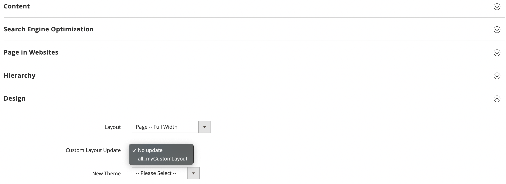

# Module Gtstudio Selectable Layout

    gtstudio/module-selected-layout

 - [Main Functionalities](#markdown-header-main-functionalities)
 - [Usage](#markdown-header-usage)
 - [Installation](#markdown-header-installation)
 - [Specifications](#markdown-header-specifications)

## Main Functionalities
This module Make Custom Layout Update file selectable generally available in all categories, products and cms pages.
Based on this request : https://github.com/magento/magento2/issues/26901

## Usage
With this module, you will be able to create generals selectable layouts updates like this :

`catalog_category_view_selectable_all_mycustomLayout`
`catalog_product_view_selectable_all_mycustomLayout`
`cms_page_view_selectable_all_mycustomLayout`

So this layout update will be available on all cms pages, categories or products on field "Custom Layout Update"

## Installation
\* = in production please use the `--keep-generated` option

### Type 1: Zip file

 - Unzip the zip file in `app/code/Gtstudio`
 - Enable the module by running `php bin/magento module:enable Gtstudio_DarkMode`
 - Apply database updates by running `php bin/magento setup:upgrade`\*
 - Flush the cache by running `php bin/magento cache:flush`

### Type 2: Composer

 - Install the module composer by running `composer require gtstudio/module-selected-layout`
 - enable the module by running `php bin/magento module:enable Gtstudio_SelectedLayout`
 - apply database updates by running `php bin/magento setup:upgrade`\*
 - Flush the cache by running `php bin/magento cache:flush`

## Specifications

 - Plugin `Magento\Cms\Model\Page\CustomLayout\CustomLayoutManager`
 - Plugin `Magento\Catalog\Model\Category\Attribute\LayoutUpdateManager`
 - Plugin `Magento\Catalog\Model\Product\Attribute\LayoutUpdateManager`